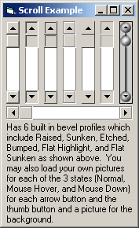



## \_ Custom Scrollbar \(100% Customizable\) \_

### Description

I GUARANTEE this is the BEST custom scrollbar you will find here on PSC. Has 6 preset bevel profiles, 3 mouse states (Normal, Mouse Hover, and Mouse Down), and you may use pictures in place of each of them giving you endless possibilities. The code is not commented yet but I will get to it soon and reupload it when I'm done. But this code is VERY clean and easy to follow. Please vote, I worked very hard on this.
 
### More Info
 

             |
---                |---
**Submitted On**   |2004-06-03 04:07:22
**By**             |[KRYO\_11](https://github.com/Planet-Source-Code/PSCIndex/blob/master/ByAuthor/kryo-11.md)
**Level**          |Advanced
**User Rating**    |4.6 (124 globes from 27 users)
**Compatibility**  |VB 5\.0, VB 6\.0
**Category**       |[Custom Controls/ Forms/  Menus](https://github.com/Planet-Source-Code/PSCIndex/blob/master/ByCategory/custom-controls-forms-menus__1-4.md)
**World**          |[Visual Basic](https://github.com/Planet-Source-Code/PSCIndex/blob/master/ByWorld/visual-basic.md)
**Archive File**   |[\_\_Custom\_S175321632004\.zip](https://github.com/Planet-Source-Code/kryo-11-custom-scrollbar-100-customizable__1-54155/archive/master.zip)

